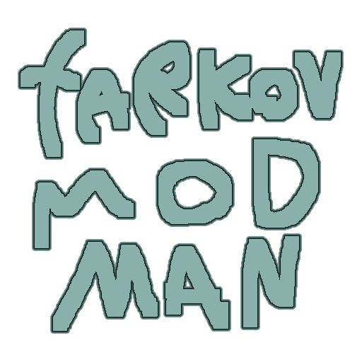

# Tarkov Mod Manager for SPT

> A simple SPT Mod Manager that I made for a friend.

# Previews

## Features
### Instances
> Like MO2 or Multi-MC you can create full seperate instances of mods for different playthroughs or modding experinces.
### Server and Client mod selection
> You can specify the exact client mods you want, along with server mods.
### Built in server and launcher support
> You can run the server and launcher, or connect to a friend's by using their host URL
### Profile based instances
> Your profiles are based on your instances, allowing you to connect to multipile servers without worrying about your data!

## Planned
While this was made for a friend, I do plan on adding more features like:
- Support for server database based instances (basically storing the data of other players on different instances)
- Direct downloads from websites (like github, or even maybe the official spt website)

## Download
Like most mod managers right now, this one is in heavy beta. I suggest you backup your whole spt directly (besides the data folders for escape from tarkov)

You can find the latest release [here](https://github.com/Kade-github/Tarkov-Mod-Manager/releases/latest)

## Instructions
- Download the latest release and extract it into a folder
- Create two folders, one for instances, and one for your mods.
- Run the mod manager and go into settings, then browse for those said paths (along with spt itself)
- Drop your mods into the mods folder, it should look like this:

- You now can create instances and add mods into those instances.
